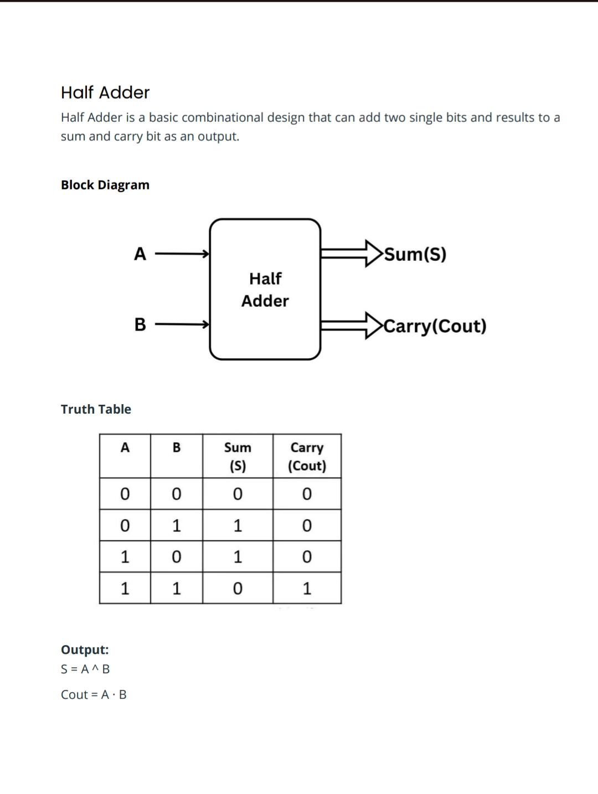
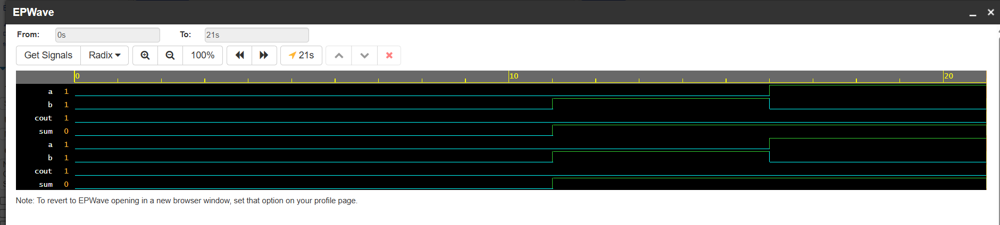

# **Half Adder Implementation in SystemVerilog (EDA Playground)**

This project implements a **Half Adder** using **SystemVerilog** and verifies it using a **basic testbench** on **EDA Playground** with the _Icarus Verilog + EPWave_ simulation environment.

----------

## **Project Overview**

A **Half Adder** is a fundamental combinational logic circuit that performs the addition of two single-bit binary inputs:

-   **a**: input bit
    
-   **b**: input bit
    
-   **sum**: output bit (LSB of addition)
    
-   **cout**: carry-out bit (MSB of addition)
    

The logic equations are:

-   `sum = a XOR b`
    
-   `cout = a AND b`
    

    

----------

## **Files Included**

### **1. design.sv**

Contains the SystemVerilog module for the half adder:

-   declares inputs and outputs using `logic`
    
-   implements combinational logic using `assign`
    
-   synthesizable and simulator-friendly


```
module half_adder(
    input  logic a,
    input  logic b,
    output logic sum,
    output logic cout
);
    assign sum  = a ^ b;   
    assign cout = a & b;   
endmodule
```
    

### **2. testbench.sv**

Contains the testbench to verify the design:

-   declares stimulus signals
    
-   instantiates the DUT
    
-   applies all combinations of input values
    
-   generates a VCD waveform using `$dumpfile` and `$dumpvars`
    
-   ends simulation with `$finish`


```
module tb_half_adder;
  
    logic a, b;
    logic sum, cout;

    // Instantiate the DUT
    half_adder dut (
        .a(a),
        .b(b),
        .sum(sum),
        .cout(cout)
    );

    initial begin
        // Initialize
      	$dumpfile("dump.vcd");
    	$dumpvars(0, tb_half_adder);
        a = 0; 
        b = 0;
        #1;

        // Apply test vectors
        #5 a = 0; b = 0;
        #5 a = 0; b = 1;
        #5 a = 1; b = 0;
        #5 a = 1; b = 1;

        $finish;
    end

endmodule
```
    

----------

## **How It Works**

The testbench drives the following input combinations with delays:

```
(a,b) = 00  
(a,b) = 01  
(a,b) = 10  
(a,b) = 11
``` 

After each update, you can observe the `sum` and `cout` changes in the waveform viewer (EPWave).

The `$dumpvars` statement dumps the full hierarchy, so signals from both the testbench and DUT appear in the waveform.

----------

## **Running on EDA Playground**

1.  Go to **[https://edaplayground.com](https://edaplayground.com)**
    
2.  Select:
    
    -   **Icarus Verilog (vvp)** as the simulator
        
    -   **EPWave** as the waveform viewer
        
3.  Add two files:
    
    -   `design.sv`
        
    -   `testbench.sv`
        
4.  Click **Run**
    
5.  Open the waveform to view input/output transitions
    

----------

## **Simulation Output**



