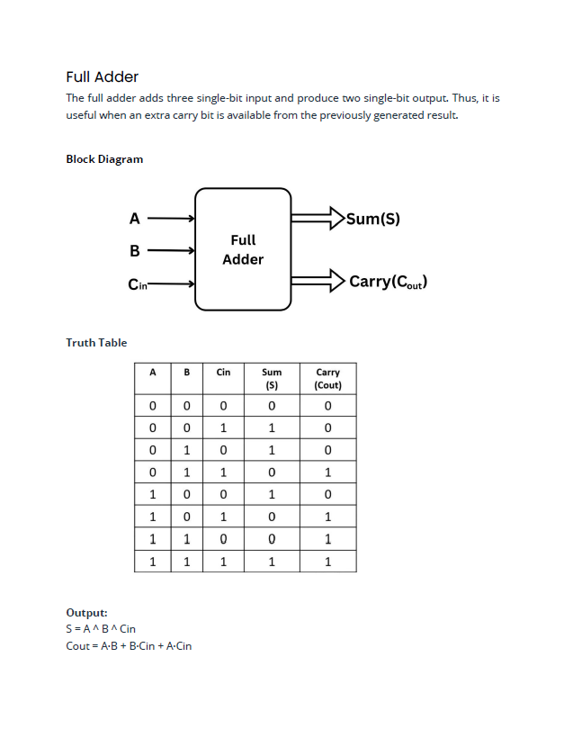
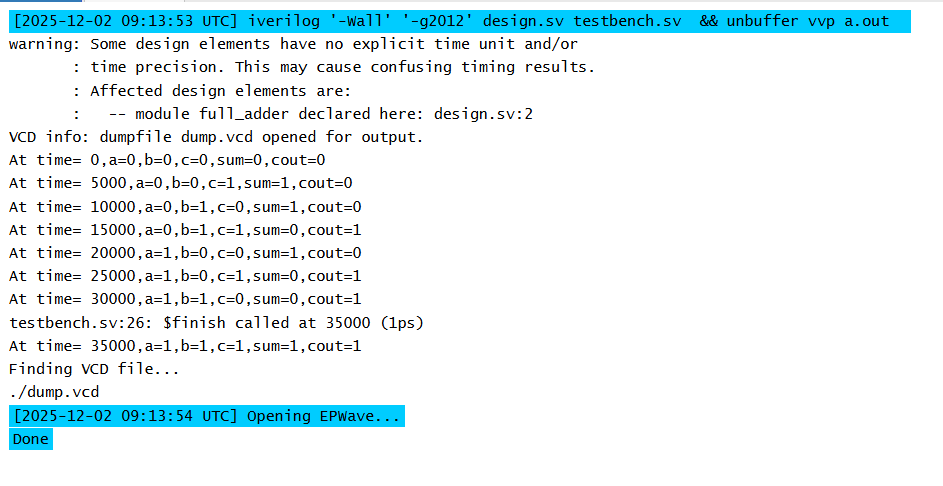
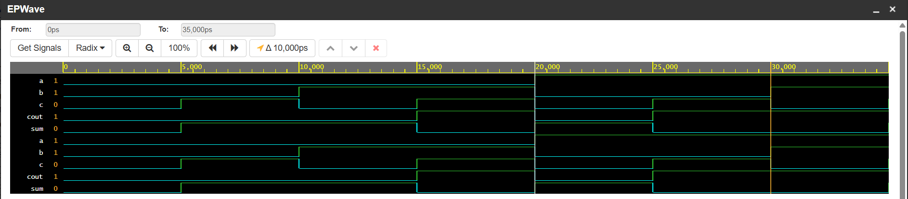

# 📘 Full Adder – SystemVerilog (Design + Testbench)

## 1. Overview

This project implements a **1-bit Full Adder** in SystemVerilog along with a simple directed testbench.  
A full adder adds three single-bit inputs:

-   **a** – first input bit
    
-   **b** – second input bit
    
-   **c** – carry-in
    

and produces:

-   **sum** – 1-bit sum output
    
-   **cout** – carry-out
    

This design uses basic combinational logic and verifies all **8 possible input combinations**.

----------

## 2. Design File – `full_adder.sv`

The full adder outputs:

`sum = a ^ b ^ c cout = (a & b) | (b & c) | (c & a)` 

These are the standard Boolean equations for a 1-bit full adder.

----------

## 3. Testbench – `tb_full_adder.sv`

The testbench does the following:

1.  Instantiates the DUT (`full_adder`)
    
2.  Applies all 8 input combinations with equal timing
    
3.  Uses:
    
    -   `$monitor` for continuous output printing
        
    -   `$dumpfile` and `$dumpvars` to generate a VCD waveform
        
4.  Ends simulation with `$finish`
    

The testbench uses `#5` delays so each vector is visible separately in the waveform.

----------

## **4. Running on EDA Playground**

1.  Go to  **[https://edaplayground.com](https://edaplayground.com/)**
    
2.  Select:
    
    -   **Icarus Verilog (vvp)**  as the simulator
        
    -   **EPWave**  as the waveform viewer
        
3.  Add two files:
    
    -   `design.sv`
        
    -   `testbench.sv`
        
4.  Click  **Run**
    
5.  Open the waveform to view input/output transitions

----------

## 5. Expected Console Output

When the testbench runs, `$monitor` prints:

This table corresponds exactly to the expected truth table of a full adder.

----------

## 6. Expected Waveform (dump.vcd)

You will see:

-   **Inputs a, b, c** toggling through all 8 patterns
    
-   **sum** correctly following XOR logic
    
-   **cout** asserted when any two inputs are 1
    

    

The waveform clearly shows the correctness of the design.